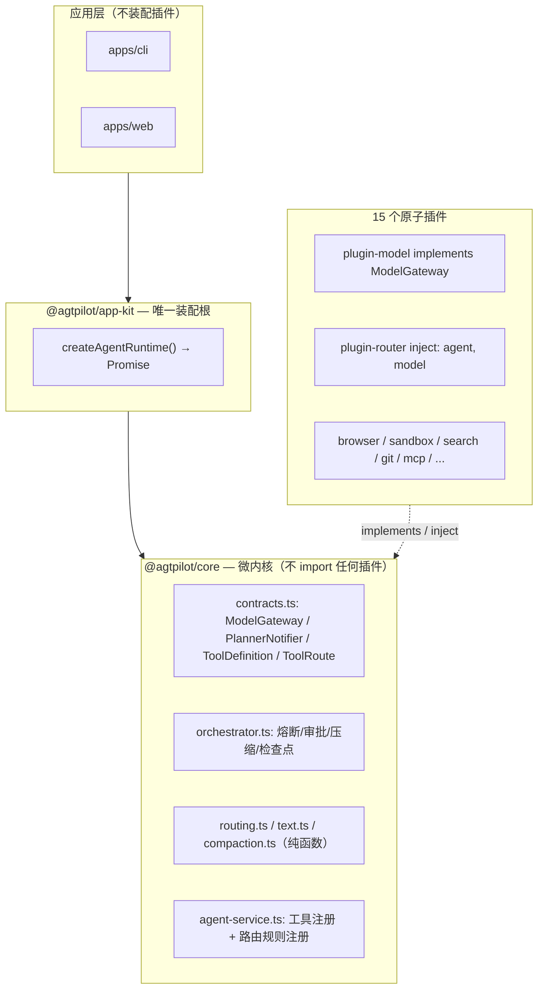

# agtpilot 架构说明

> 本文档描述当前架构，并记录曾经犯过的错与对应约束 —— 修改架构前请先读完「分层的铁律」与「反模式清单」两节。

## 总览

微内核 + 插件（cordis）+ 唯一装配根（composition root）三层结构：

依赖方向只有一条合法路径：**Apps → app-kit → core ← plugins**。
插件实现内核声明的接口（依赖倒置），内核永远不知道任何插件的存在。

## 各层职责

### `packages/core` — 微内核

| 模块 | 职责 |
|---|---|
| `contracts.ts` | 全部跨层接口：`ModelGateway`、`PlannerNotifier`、`ToolDefinition`、`ToolRoute`、loop 类型 |
| `orchestrator.ts` | 任务编排：审批门、熔断、任务内压缩、`agtpilot/checkpoint`/`agtpilot/usage` 事件 |
| `agent-service.ts` | 工具注册表 + `registerToolRoute()` 路由规则注册表 |
| `routing.ts` | 工具按需挂载（阈值门 + 关键词路由）、token 估算、死循环参数归一 |
| `text.ts` / `compaction.ts` | 工具输出截断策略 / 会话压缩（纯函数，蒸馏能力回调注入） |
| `index.ts` | 模块增强唯一归属地：`Context.agent/orchestrator/model/planner` 与全部 `agtpilot/*` 事件类型 |

内核获取可选服务用 `ctx.reflect.get('model')`（不 inject，缺失时给出可读报错）；必需服务在插件侧用 `inject` 声明。

### `packages/app-kit` — 唯一装配根

`createAgentRuntime()`：core 先挂，插件并列挂载（顺序不敏感，依赖由 cordis `inject` 解析），单插件失败仅跳过并记录进 `loaded`。返回的 **Promise resolve 即全部就绪**。router 依赖 model，model 失败时自动跳过 router 避免 inject 挂起。

### 插件层

- **plugin-model**：实现 `ModelGateway`，以 `model` 服务名注册。模型解析优先级链：`configOverride > 显式 model 参数 > preferred（router 写入）> 环境变量`。预算经 `setBudget` 设置，agent loop `stopWhen` 双闸门（步数 + token）强制收尾。
- **plugin-router**：`inject: ['agent', 'model']`，能级切换通过 `ModelGateway.setPreferredModel()` 推送 —— router 依赖 model，但 model 不依赖 router。
- **其余插件**：注册工具 + `registerToolRoute({ id, prefixes, test })` 自描述路由规则；通用小工具标 `baseline: true` 常驻。

### 应用层

不 import 插件、不手工保序加载。CLI/Web 只调 `createAgentRuntime()`。Web 侧异步启动用 `ensureRuntime()` + `whenReady()`，绝不在插件就绪前同步访问服务。

## 分层的铁律

1. **内核零插件知识。** core 的 import 列表里不允许出现 `@agtpilot/plugin-*`；需要新能力就在 `contracts.ts` 加接口，由插件实现。
2. **Context/Events 模块增强只写在 core。** 插件侧再写 `declare module` 会与 core 的同名声明接口合并冲突。插件想暴露服务：实现 core 的接口，或经 core 统一登记。
3. **跨服务调用走接口，不走 `as any`。** 编译期必须能查到类型。
4. **装配只发生在 app-kit。** 任何 app 里出现「import 15 个插件 + 手工排序」即为违规。
5. **新增插件零内核改动。** 工具路由由插件 `registerToolRoute()` 自注册；内核不维护任何前缀表。
6. **新纯函数必须带 vitest 用例**（`packages/core/src/*.test.ts`）。测试脚本必须真实失败（`vitest run`），不许静默 no-op。
7. **对外承诺（README/文档）与实际能力一致。** 持久化只承诺已实现的部分（检查点 + 续跑），不承诺没实现的（in-flight 循环自动重启）。

## 反模式清单（都真的犯过）

| # | 反模式 | 后果 | 正确做法 |
|---|---|---|---|
| 1 | 内核里 `import type { ModelService } from '@agtpilot/plugin-model'` + `ctx.model as any` | 内核与插件双向耦合，换模型实现要改内核 | contracts.ts 接口 + `reflect.get` |
| 2 | 内核硬编码 `TOOL_GROUPS` / `BASELINE_TOOLS` 前缀表 | 每新增插件都要改内核 | 插件 `registerToolRoute()` + `baseline: true` |
| 3 | plugin-router 只在 README 里存在，没接 model | 工具描述骗模型 | 能级切换经 `setPreferredModel()` 真实生效 |
| 4 | CLI 和 Web 各维护一份装配列表 | 新增插件改两处，顺序错了服务解析不到 | app-kit 唯一装配根 |
| 5 | core 同时存在「插件形态」和「裸 new 手动实例化」两套用法 | 启动路径不明，事件时序不可控 | 统一 cordis 插件形态 `apply(ctx)` |
| 6 | Web 在模块加载时同步访问 `ctx.mcp` 等服务 | 插件未就绪 → undefined 崩溃 | `whenReady()` + 类型化 getter |
| 7 | 任务状态只存内存单例 | 进程重启即全部丢失 | checkpoint 事件节流落盘 + 启动僵尸清扫 + rehydrate 续跑 |
| 8 | `test: 'echo \"no tests\"'` 静默通过 | CI 绿灯但零覆盖 | vitest 真实跑，30 用例守护 routing/text/compaction |
| 9 | 插件侧 `declare module` 增强 `Context.model` | 与 core 的声明接口合并冲突、类型漂移 | 声明全部收敛 core |

## 事件清单（cordis 事件 ≠ AgentEvent）

- `agtpilot/tool-registered` / `agtpilot/plan` / `agtpilot/artifact` —— 注册与插件侧通知
- `agtpilot/event`（AgentEvent）—— 面向前端 UI 的广播流（observability 转发）
- `agtpilot/usage` —— 每轮 loop 真实 token 用量（router 统计）
- `agtpilot/checkpoint` —— 每步消息快照（web 落盘用；**刻意不走 AgentEvent 广播**，避免事件数组 O(n²) 膨胀）

## 新增插件检查单

1. 新建 `packages/plugin-xxx/`，`inject` 声明所需服务（仅允许 core 契约里的服务名）
2. `ctx.agent.registerToolRoute({ id, prefixes: ['xxx_'], test: /关键词|keyword/i })` —— 想被按需挂载就必须做
3. 通用小工具加 `baseline: true`
4. 描述写真实能力，禁止「假存在」描述
5. app-kit 的 `createAgentRuntime()` 里 `mount('plugin-xxx', XxxPlugin)` 一行（失败自动隔离）
6. 依赖加进 `packages/app-kit/package.json`，根目录 `pnpm install`

## 环境变量

| 变量 | 默认 | 作用 |
|---|---|---|
| `AGTPILOT_TOOL_ROUTING=0` | 开 | 整体关闭工具路由（全量挂载） |
| `AGTPILOT_CONTEXT_WINDOW` | 64000 | 上下文窗口估算（阈值门基数，下限 1024） |
| `AGTPILOT_TOOL_SEARCH_THRESHOLD` | 10 (%) | 工具声明 tokens 超过窗口该比例才启用路由 |
| `AGTPILOT_COMPACT_THRESHOLD` | 30000 | 会话压缩触发阈值（tokens，下限 2000） |
| `AGTPILOT_COMPACT_RECENT` | 10 | 近期保护窗口（消息数，下限 4） |
