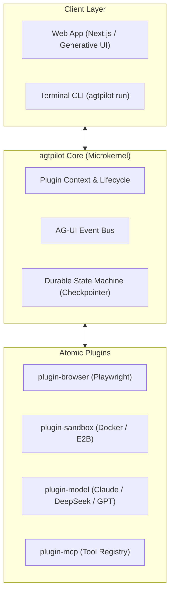

# agtpilot

> 🚀 **agtpilot** (Agent Pilot) is an open-source, pluggable, autonomous personal AI agent framework designed for real-world computer use, deep research, and day-to-day task automation.

Inspired by **OpenMuse**, **DeepSeek Harness**, and **CopilotKit**, `agtpilot` decouples agent capabilities into atomic, pluggable modules powered by TypeScript, a durable state machine, and Generative UI interaction.

---

## 🌟 Key Features

- 🧩 **Pluggable Microkernel Architecture**: Everything is a plugin. Easily swap models, sandboxes, tools, and UI components.
- 🌐 **Persistent Browser Automation**: Autonomous web browsing, form filling, login state persistence, and research driven by Playwright.
- 📦 **Isolated Code Execution Sandbox**: Safe execution of Bash scripts, Python, and Node.js code within containerized environments (Docker / E2B).
- 🔄 **Durable State & Checkpointing**: Long-running background workflows that pause, resume, and survive server restarts.
- 🎨 **Generative UI / AG-UI Protocol**: Returns rich, interactive React components (charts, approval cards, tables) directly in chat rather than boring plain text.
- 🤝 **Human-in-the-Loop (HITL)**: Built-in safety approval mechanism for sensitive operations (emailing, purchasing, deleting files).

---

## 🏗️ Architecture Overview



---

## 📂 Repository Structure (Monorepo)

```text
agtpilot/
├── packages/
│   ├── core/              # Microkernel, plugin runtime, and event bus
│   ├── plugin-browser/    # Persistent Playwright browser control
│   ├── plugin-sandbox/    # Safe Docker / E2B code execution
│   └── protocol/          # AG-UI and Generative UI event schema
├── apps/
│   ├── cli/               # Command-line interface
│   └── web/               # Next.js Generative UI frontend
├── package.json
├── pnpm-workspace.yaml
├── tsconfig.json
└── README.md
```

---

## 🚀 Quick Start

### Prerequisites
- Node.js >= 20
- pnpm >= 9
- Docker (optional, for local code sandbox execution)

### 1. Clone & Install
```bash
git clone https://github.com/tunsuy/agtpilot.git
cd agtpilot
pnpm install
```

### 2. Configure Environment
```bash
cp .env.example .env
# Fill in your LLM API keys (DeepSeek / Anthropic / OpenAI)
```

### 3. Build & Run
```bash
pnpm build
pnpm dev
```

---

## 📜 License

MIT License © 2026 [tunsuy](https://github.com/tunsuy)
