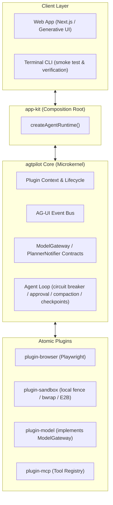

# agtpilot

English | [简体中文](./README.zh-CN.md)

> 🚀 **agtpilot** (Agent Pilot) is an open-source, pluggable, autonomous personal AI agent framework designed for real-world computer use, deep research, and day-to-day task automation.

Inspired by **OpenMuse**, **DeepSeek Harness**, and **CopilotKit**, `agtpilot` decouples agent capabilities into atomic, pluggable modules powered by TypeScript, a durable state machine, and Generative UI interaction.

[](./LICENSE)
[](https://nodejs.org)
[](https://pnpm.io)
[](https://github.com/tunsuy/agtpilot/pkgs/container/agtpilot)

---

## 🌟 Key Features

- 🧩 **Pluggable Microkernel Architecture**: Everything is a plugin. Easily swap models, sandboxes, tools, and UI components — the kernel imports no plugin, ever.
- 🌐 **Persistent Browser Automation**: Autonomous web browsing, form filling, login state persistence, and research powered by Playwright (+ Stagehand act/observe, Firecrawl anti-bot scraping).
- 📦 **Sandboxed Code Execution**: Bash/Python/Node.js execution with layered controls — path fencing, child-process env allowlist (zero credential leakage by default), credential-endpoint binding, egress guard (private/metadata IP blocking), optional bwrap kernel fence, and optional [E2B](https://e2b.dev) cloud MicroVM isolation. See [sandbox hardening design](./docs/design/sandbox-control-hardening.md).
- 🔄 **Durable Sessions & Checkpoints**: Missions and conversation history persist to disk; each agent step emits a message checkpoint. After a server restart, an interrupted mission is marked and can be resumed by continuing the conversation (the in-flight loop itself is not auto-restarted).
- 🎨 **Generative UI / AG-UI Protocol**: Returns rich, interactive React components (charts, approval cards, tables, deliverables) directly in chat rather than plain text.
- 🤝 **Human-in-the-Loop (HITL)**: Built-in safety approval gate for sensitive operations (emailing, purchasing, deleting files) — high-danger tools suspend until the user confirms.
- 🔁 **Loop Circuit Breaker & Context Compaction**: Sliding-window loop detection, token-budget stop gates, and automatic session compaction keep long missions cheap and on rails.
- 📱 **Web + Mobile**: A Next.js PWA that can also be packaged as native Android/iOS apps via Capacitor; multi-provider auth (GitHub / Google / Apple / WeChat) via Auth.js v5.
- ⏰ **Autonomous Scheduling**: Headless cron engine (croner) lets the agent wake itself up — "every morning at 9, summarize AI papers" is a tool call away.

---

## 🏗️ Architecture Overview



**Dependency inversion**: the microkernel imports no plugin — it only depends on the `ModelGateway` / `PlannerNotifier` interfaces (`packages/core/src/contracts.ts`), which plugins implement and register as same-named cordis services. Tool routing rules are likewise self-registered by each plugin (`ctx.agent.registerToolRoute()`), so adding a plugin never touches the kernel. `packages/app-kit` is the single composition root: both CLI and Web call `createAgentRuntime()` to load the kernel and the full plugin set; the returned Promise resolving means everything is ready.

> The layering laws, anti-pattern list, and a new-plugin checklist live in [ARCHITECTURE.md](./ARCHITECTURE.md).

---

## 📂 Repository Structure (Monorepo)

```text
agtpilot/
├── packages/
│   ├── core/              # Microkernel: contracts (ModelGateway), orchestrator, event bus
│   ├── app-kit/           # Composition root: createAgentRuntime() single assembly entry
│   ├── protocol/          # AG-UI and Generative UI event schema
│   ├── plugin-model/      # ModelGateway implementation (Vercel AI SDK v5)
│   ├── plugin-router/     # Capability-tier routing + token budget control
│   ├── plugin-planner/    # Task planning & progress events
│   ├── plugin-browser/    # Persistent Playwright browser control
│   ├── plugin-sandbox/    # Sandboxed code execution (local fence / bwrap / E2B)
│   ├── plugin-search/     # Web search (Exa / Tavily)
│   ├── plugin-rag/        # User-scoped document indexing & retrieval
│   ├── plugin-memory/     # Long-term memory (store / recall / list)
│   ├── plugin-mcp/        # MCP connector registry + OAuth connector center
│   ├── plugin-git/        # Git checkpoints, patches, codebase symbol search
│   ├── plugin-cron/       # Headless scheduling engine (croner)
│   ├── plugin-notify/     # Desktop & webhook notifications
│   ├── plugin-desktop/    # Desktop automation (clipboard, apps, screenshots)
│   ├── plugin-observability/ # Traces, metrics, event forwarding
│   └── plugin-artifact/   # Deliverable rendering (Generative UI artifacts)
├── apps/
│   ├── cli/               # Terminal entry: boots the runtime & verifies orchestrator capabilities
│   └── web/               # Next.js Generative UI frontend (PWA + Capacitor mobile)
├── docs/design/           # Design & research notes (Chinese)
├── scripts/               # Release helpers (GHCR image build & push)
├── docker-compose.prod.yml
├── Dockerfile
└── package.json
```

### Plugin matrix

| Package | Role | Notable tools |
|---|---|---|
| `@agtpilot/core` | Microkernel: contracts, orchestrator, routing, compaction | — |
| `@agtpilot/app-kit` | Composition root, loads kernel + all official plugins | — |
| `@agtpilot/protocol` | AG-UI / Generative UI event schema | — |
| `plugin-model` | `ModelGateway` implementation, provider resolution, budgets | — |
| `plugin-router` | Model capability tiers & budget | `router_select_tier`, `router_get_budget_status` |
| `plugin-planner` | Task planning | `planner_create_plan`, `planner_update_task` |
| `plugin-browser` | Persistent browsing & scraping | `browser_navigate/click/screenshot`, Stagehand `act/observe`, Firecrawl scrape |
| `plugin-sandbox` | Fenced execution | `sandbox_run_code/run_command/read_file/write_file/list_dir/http_request` |
| `plugin-search` | Web search | `search_web`, `search_exa`, `search_tavily` |
| `plugin-rag` | Retrieval | `rag_index_document`, `rag_search`, `rag_list_indexed` |
| `plugin-memory` | Long-term memory | `memory_store`, `memory_recall`, `memory_list` |
| `plugin-mcp` | MCP tool registry & connectors | — (tool exposure is app-level) |
| `plugin-git` | Code & version control | `git_status/diff`, checkpoints, patches, `codebase_search_symbols` |
| `plugin-cron` | Scheduling engine | — (exposed as `cron_schedule_task` by the apps) |
| `plugin-notify` | Notifications | `notify_send_desktop`, `notify_send_webhook` |
| `plugin-desktop` | Desktop automation | clipboard read/write, open app, screenshot, system info |
| `plugin-observability` | Observability | `observability_get_trace`, `observability_get_metrics` |
| `plugin-artifact` | Deliverables | `artifact_render` |

---

## 🚀 Quick Start

### Prerequisites

- Node.js >= 20
- pnpm >= 9
- [bubblewrap](https://github.com/containers/bubblewrap) (bwrap, optional: kernel-level fence for local code execution on Linux)

### 1. Clone & install

```bash
git clone https://github.com/tunsuy/agtpilot.git
cd agtpilot
pnpm install
```

### 2. Configure environment

```bash
cp .env.example .env
# Fill in at least one LLM API key (DEEPSEEK_API_KEY / OPENAI_API_KEY / ANTHROPIC_API_KEY)
```

Optional integrations (each is independently enabled when its key is present):

| Variable | Service | Get a key |
|---|---|---|
| `E2B_API_KEY` | Cloud MicroVM sandbox | [e2b.dev](https://e2b.dev) |
| `EXA_API_KEY` | Neural/semantic search | [exa.ai](https://exa.ai) |
| `TAVILY_API_KEY` | Agent-optimized search | [tavily.com](https://tavily.com) |
| `FIRECRAWL_API_KEY` | Anti-bot web scraping | [firecrawl.dev](https://firecrawl.dev) |

Auth providers (GitHub / Google / Apple / WeChat OAuth) are configured in the same file; in development a mock login is available (`AUTH_ALLOW_MOCK`, dev-only by default).

### 3. Run

Packages ship TypeScript sources directly (`main: src/index.ts`) and the web app transpiles them, so no pre-build is needed in development:

```bash
pnpm dev
```

Open <http://localhost:3000>.

The CLI entry is a runtime smoke test rather than a chat REPL — it boots the full runtime, prints every loaded service and tool, and verifies the orchestrator's circuit breaker, HITL approval, event stream, and checkpoint machinery:

```bash
pnpm exec tsx apps/cli/src/bin.ts
```

### Runtime knobs

| Variable | Default | Effect |
|---|---|---|
| `AGTPILOT_TOOL_ROUTING` | on | `0` disables tool routing (mount all tools every turn) |
| `AGTPILOT_CONTEXT_WINDOW` | 64000 | Context window estimate (basis of the routing threshold gate) |
| `AGTPILOT_TOOL_SEARCH_THRESHOLD` | 10 (%) | Route only when tool declarations exceed this share of the window |
| `AGTPILOT_COMPACT_THRESHOLD` | 30000 | Session compaction trigger (tokens) |
| `AGTPILOT_COMPACT_RECENT` | 10 | Recent-message protection window (count) |

---

## 🐳 Docker Deployment

A production image is published to GHCR on every `v*` tag:

```bash
cp .env.production.example .env.production  # fill in real values
docker compose -f docker-compose.prod.yml up -d
```

The compose file mounts persistent state (`/opt/agtpilot/data`, `/opt/agtpilot/sandbox` on the host). To build locally instead:

```bash
./scripts/release-ghcr.sh <tag>
```

---

## 🛡️ Security Model

The agent executes model-chosen code and shell commands by design, so the sandbox is layered rather than optional:

- **Path fencing** — execution is jailed to a per-task working directory.
- **Env allowlist** — child processes receive only `PATH/HOME/LANG/TZ/TMPDIR` plus task-scoped user credentials; the host's `process.env` is never forwarded wholesale.
- **Credential-endpoint binding & egress guard** — private/metadata IP ranges are blocked.
- **Optional kernel fence** (bwrap on Linux) and **cloud isolation** (E2B Firecracker MicroVM).
- **HITL approval gate** — tools marked `dangerLevel: high` suspend until a human confirms.
- **Multi-user scoping** — all process-level state (RAG index, browser profile, artifacts) is partitioned by `session.userId`.

Details: [docs/design/sandbox-control-hardening.md](./docs/design/sandbox-control-hardening.md) (Chinese). For vulnerabilities, see [SECURITY.md](./SECURITY.md).

---

## 📚 Documentation

- [ARCHITECTURE.md](./ARCHITECTURE.md) — layering laws, anti-pattern list, new-plugin checklist
- [docs/README.md](./docs/README.md) — index of design & research notes (evals, decision models, sandbox, state governance)

### Roadmap highlights

Tracked in the design docs (Chinese):

- External benchmark harness — Gaia2 / BrowseComp-Plus / τ²-bench / OSWorld adapters
- Decision-model integration — a `DecisionGateway` contract at the D1–D4 decision points
- Evals + hillclimb — automated regression evaluation for agent capabilities
- Computer-use evaluation — trycua/cua feasibility

---

## 🤝 Contributing

See [CONTRIBUTING.md](./CONTRIBUTING.md). PRs welcome — especially new atomic plugins (the checklist makes it a ~9-step process) and tests for the pure kernel functions.

---

## 📜 License

MIT License © 2026 [tunsuy](https://github.com/tunsuy) — see [LICENSE](./LICENSE).
