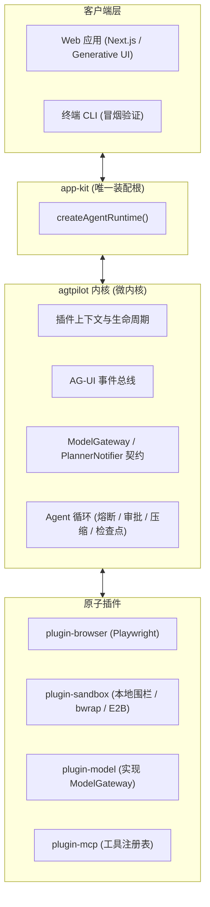

# agtpilot

[English](./README.md) | 简体中文

> 🚀 **agtpilot**（Agent Pilot）是一个开源、可插拔的自主个人 AI Agent 框架，面向真实世界的计算机操作、深度研究与日常任务自动化。

agtpilot 受 **OpenMuse**、**DeepSeek Harness** 与 **CopilotKit** 启发，以 TypeScript、可持久化的状态机和 Generative UI 交互为基础，把 Agent 能力拆解为原子化的可插拔模块。

[](./LICENSE)
[](https://nodejs.org)
[](https://pnpm.io)
[](https://github.com/tunsuy/agtpilot/pkgs/container/agtpilot)

---

## 🌟 核心特性

- 🧩 **可插拔微内核架构**：一切皆插件。模型、沙箱、工具、UI 组件皆可替换——内核从不 import 任何插件。
- 🌐 **持久化浏览器自动化**：基于 Playwright 的自主网页浏览、表单填写、登录态保持与深度研究（+ Stagehand act/observe、Firecrawl 反爬抓取）。
- 📦 **沙箱化代码执行**：Bash/Python/Node.js 执行带多层控制——路径围栏、子进程环境白名单（默认零凭据外泄）、凭据-端点绑定、出口守卫（私网/元数据 IP 封锁）、可选 bwrap 内核级围栏、可选 [E2B](https://e2b.dev) 云端 MicroVM 隔离。详见[沙箱加固设计](./docs/design/sandbox-control-hardening.md)。
- 🔄 **持久会话与检查点**：任务与会话历史落盘；Agent 每一步都发出消息检查点。服务重启后，被打断的任务会被标记，可通过继续对话续跑（执行中的循环本身不会自动重启）。
- 🎨 **Generative UI / AG-UI 协议**：在对话里直接返回丰富的交互式 React 组件（图表、审批卡片、表格、交付物），而不是干巴巴的纯文本。
- 🤝 **人机协同（HITL）**：内置安全审批门——高危工具（发邮件、购买、删文件）会挂起，等用户确认后才执行。
- 🔁 **熔断器与上下文压缩**：滑动窗口死循环检测、token 预算双闸门、自动会话压缩，让长任务省钱且不脱轨。
- 📱 **Web + 移动端**：Next.js PWA，可经 Capacitor 打包为 Android/iOS 原生应用；Auth.js v5 多渠道登录（GitHub / Google / Apple / 微信）。
- ⏰ **自主调度**：无头 cron 引擎（croner）让 Agent 自己唤醒自己——「每天早上 9 点总结 AI 论文」就是一次工具调用的事。

---

## 🏗️ 架构总览



**依赖倒置**：微内核不 import 任何插件——它只依赖 `ModelGateway` / `PlannerNotifier` 接口（`packages/core/src/contracts.ts`），由插件提供实现并以同名 cordis 服务注册。工具路由规则同样由各插件自注册（`ctx.agent.registerToolRoute()`），新增插件无需改动内核。`packages/app-kit` 是唯一装配根：CLI 与 Web 共用 `createAgentRuntime()` 统一装配内核与全套插件；返回的 Promise resolve 即全部就绪。

> 分层铁律、反模式清单与新增插件检查单详见 [ARCHITECTURE.md](./ARCHITECTURE.md)（中文）。

---

## 📂 仓库结构（Monorepo）

```text
agtpilot/
├── packages/
│   ├── core/              # 微内核：契约 (ModelGateway)、编排器、事件总线
│   ├── app-kit/           # 唯一装配根：createAgentRuntime() 统一启动入口
│   ├── protocol/          # AG-UI 与 Generative UI 事件 schema
│   ├── plugin-model/      # ModelGateway 实现 (Vercel AI SDK v5)
│   ├── plugin-router/     # 能级路由 + token 预算控制
│   ├── plugin-planner/    # 任务规划与进度事件
│   ├── plugin-browser/    # 持久化 Playwright 浏览器控制
│   ├── plugin-sandbox/    # 沙箱化代码执行 (本地围栏 / bwrap / E2B)
│   ├── plugin-search/     # 网络搜索 (Exa / Tavily)
│   ├── plugin-rag/        # 按用户分域的文档索引与检索
│   ├── plugin-memory/     # 长期记忆 (存 / 取 / 列)
│   ├── plugin-mcp/        # MCP 连接器注册表 + OAuth 连接器中心
│   ├── plugin-git/        # Git 检查点、补丁、代码库符号搜索
│   ├── plugin-cron/       # 无头调度引擎 (croner)
│   ├── plugin-notify/     # 桌面与 Webhook 通知
│   ├── plugin-desktop/    # 桌面自动化 (剪贴板、应用、截屏)
│   ├── plugin-observability/ # 追踪、指标、事件转发
│   └── plugin-artifact/   # 交付物渲染 (Generative UI 产物)
├── apps/
│   ├── cli/               # 终端入口：启动运行时并验证编排器关键能力
│   └── web/               # Next.js Generative UI 前端 (PWA + Capacitor 移动端)
├── docs/design/           # 设计与研究笔记 (中文)
├── scripts/               # 发布辅助 (GHCR 镜像构建与推送)
├── docker-compose.prod.yml
├── Dockerfile
└── package.json
```

### 插件矩阵

| 包 | 职责 | 代表工具 |
|---|---|---|
| `@agtpilot/core` | 微内核：契约、编排器、路由、压缩 | — |
| `@agtpilot/app-kit` | 装配根，装载内核 + 全部官方插件 | — |
| `@agtpilot/protocol` | AG-UI / Generative UI 事件 schema | — |
| `plugin-model` | `ModelGateway` 实现、模型解析、预算 | — |
| `plugin-router` | 模型能级与预算 | `router_select_tier`、`router_get_budget_status` |
| `plugin-planner` | 任务规划 | `planner_create_plan`、`planner_update_task` |
| `plugin-browser` | 持久化浏览与抓取 | `browser_navigate/click/screenshot`、Stagehand `act/observe`、Firecrawl 抓取 |
| `plugin-sandbox` | 围栏内执行 | `sandbox_run_code/run_command/read_file/write_file/list_dir/http_request` |
| `plugin-search` | 网络搜索 | `search_web`、`search_exa`、`search_tavily` |
| `plugin-rag` | 检索 | `rag_index_document`、`rag_search`、`rag_list_indexed` |
| `plugin-memory` | 长期记忆 | `memory_store`、`memory_recall`、`memory_list` |
| `plugin-mcp` | MCP 工具注册表与连接器 | —（工具暴露在应用层） |
| `plugin-git` | 代码与版本控制 | `git_status/diff`、检查点、补丁、`codebase_search_symbols` |
| `plugin-cron` | 调度引擎 | —（由应用层暴露为 `cron_schedule_task`） |
| `plugin-notify` | 通知 | `notify_send_desktop`、`notify_send_webhook` |
| `plugin-desktop` | 桌面自动化 | 剪贴板读写、打开应用、截屏、系统信息 |
| `plugin-observability` | 可观测性 | `observability_get_trace`、`observability_get_metrics` |
| `plugin-artifact` | 交付物 | `artifact_render` |

---

## 🚀 快速开始

### 前置要求

- Node.js >= 20
- pnpm >= 9
- [bubblewrap](https://github.com/containers/bubblewrap)（bwrap，可选：Linux 上本地代码执行的内核级围栏）

### 1. 克隆并安装

```bash
git clone https://github.com/tunsuy/agtpilot.git
cd agtpilot
pnpm install
```

### 2. 配置环境

```bash
cp .env.example .env
# 至少填入一个 LLM API Key (DEEPSEEK_API_KEY / OPENAI_API_KEY / ANTHROPIC_API_KEY)
```

可选集成（各自的 Key 存在时独立启用）：

| 变量 | 服务 | 获取 Key |
|---|---|---|
| `E2B_API_KEY` | 云端 MicroVM 沙箱 | [e2b.dev](https://e2b.dev) |
| `EXA_API_KEY` | 神经/语义搜索 | [exa.ai](https://exa.ai) |
| `TAVILY_API_KEY` | 面向 Agent 优化的搜索 | [tavily.com](https://tavily.com) |
| `FIRECRAWL_API_KEY` | 反爬网页抓取 | [firecrawl.dev](https://firecrawl.dev) |

登录渠道（GitHub / Google / Apple / 微信 OAuth）在同一文件里配置；开发环境可用模拟登录（`AUTH_ALLOW_MOCK`，默认仅开发环境开启）。

### 3. 运行

各包直接以 TypeScript 源码发布（`main: src/index.ts`），web 应用会转译它们，开发无需预构建：

```bash
pnpm dev
```

打开 <http://localhost:3000>。

CLI 入口是运行时冒烟测试而非对话 REPL——它启动完整运行时，打印已装载的服务与工具，并验证编排器的熔断器、HITL 审批、事件流与检查点机制：

```bash
pnpm exec tsx apps/cli/src/bin.ts
```

### 运行时调参

| 变量 | 默认 | 作用 |
|---|---|---|
| `AGTPILOT_TOOL_ROUTING` | 开 | `0` 关闭工具路由（每轮全量挂载） |
| `AGTPILOT_CONTEXT_WINDOW` | 64000 | 上下文窗口估算（路由阈值门基数） |
| `AGTPILOT_TOOL_SEARCH_THRESHOLD` | 10 (%) | 工具声明 tokens 超过窗口该比例才启用路由 |
| `AGTPILOT_COMPACT_THRESHOLD` | 30000 | 会话压缩触发阈值（tokens） |
| `AGTPILOT_COMPACT_RECENT` | 10 | 近期保护窗口（消息数） |

---

## 🐳 Docker 部署

每个 `v*` tag 会自动发布生产镜像到 GHCR：

```bash
cp .env.production.example .env.production  # 填入真实配置
docker compose -f docker-compose.prod.yml up -d
```

compose 文件挂载了持久化状态（宿主机 `/opt/agtpilot/data`、`/opt/agtpilot/sandbox`）。想本地构建镜像：

```bash
./scripts/release-ghcr.sh <tag>
```

---

## 🛡️ 安全模型

Agent 天生要执行模型选择的代码与 shell 命令，所以沙箱是多层控制而非可选项：

- **路径围栏**——执行被囚禁在按任务划分的工作目录内。
- **环境白名单**——子进程只拿到 `PATH/HOME/LANG/TZ/TMPDIR` 加任务级用户凭据；绝不整包转发宿主的 `process.env`。
- **凭据-端点绑定与出口守卫**——封锁私网/元数据 IP 段。
- **可选内核围栏**（Linux bwrap）与**云端隔离**（E2B Firecracker MicroVM）。
- **HITL 审批门**——标记 `dangerLevel: high` 的工具挂起等人确认。
- **多用户分域**——所有进程级状态（RAG 索引、浏览器 profile、交付物）按 `session.userId` 隔离。

细节见 [docs/design/sandbox-control-hardening.md](./docs/design/sandbox-control-hardening.md)。漏洞报告请走 [SECURITY.md](./SECURITY.md)。

---

## 📚 文档

- [ARCHITECTURE.md](./ARCHITECTURE.md) — 分层铁律、反模式清单、新增插件检查单
- [docs/README.md](./docs/README.md) — 设计与研究笔记索引（评测、决策模型、沙箱、状态治理）

### 路线图要点

记录在设计文档中：

- 外部基准评测——Gaia2 / BrowseComp-Plus / τ²-bench / OSWorld 适配器
- 决策模型集成——在 D1–D4 决策点接入 `DecisionGateway` 契约
- 评测与爬坡——Agent 能力的自动化回归评测
- 计算机使用评估——trycua/cua 可行性

---

## 🤝 参与贡献

见 [CONTRIBUTING.md](./CONTRIBUTING.md)。欢迎 PR——尤其是新的原子插件（照着检查单大约 9 步）和内核纯函数的测试用例。

---

## 📜 许可证

MIT License © 2026 [tunsuy](https://github.com/tunsuy) — 详见 [LICENSE](./LICENSE)。
