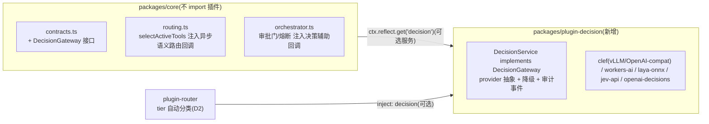

# Jev 类决策模型(System One)集成设计与选型

- 日期: 2026-10-10
- 状态: **设计提案**(未动任何代码;是否排期 P0 待负责人决策)
- 前置阅读: `ARCHITECTURE.md`(分层铁律 / 反模式清单 / 新增插件检查单)、`docs/design/eval-hillclimb-framework.md`(评测与爬坡框架,本设计的验收依赖它)、`docs/design/cua-integration-notes.md`(同期另一份集成提案,写法对齐)
- 外部参照: TypeSafe Jev(2026-09-15 发布)、OpenAI Decisions API(2026-09-29)、Cloudflare Clef/Clef-flash(2026-10,含 43 项对比实测)、StartLux-Decision(2026-09-30)、Decision Index 榜单(huggingface.co/spaces/multimodalart/jev-decision-index,复现包 github.com/apolinario/decision-index)。数据以各家原始出处为准,本文只截 2026-10-10 快照。

## 1. 这是什么、为什么 agtpilot 需要

「决策模型」是 2026-09 起爆火的新模型品类(Kahneman「系统一」隐喻):**不生成文本**,输入一段 state(文本/结构化数据)+ 一组 typed 问题,单次并行前向直出**带置信度的结构化裁决**(Choice / Score / 概率分布),应用代码零解析直接消费。相对 LLM-as-judge 的卖点:延迟低 1-2 个数量级(6~500ms vs 秒级)、成本低 2 个数量级、输出类型安全、无「自由发挥」空间。

agtpilot 的 harness 里天然存在一批**高频、小粒度、结构化**的决策点,目前全部用「正则/阈值/静态标注」这类启发式硬编码兜着。它们正是决策模型的目标场景:

| # | 决策点 | 现状(代码位置) | 现状的问题 |
|---|---|---|---|
| D1 | **工具按需挂载路由** | `core/routing.ts selectActiveTools()`:阈值门 + 插件注册的**正则关键词**规则 | 正则覆盖不了语义变体(「帮我看下这个网页」不命中 `browser_` 关键词就漏挂);拿不准时全量兜底,路由形同虚设 |
| D2 | **模型能级切换** | `plugin-router setTier()`:纯手动/应用层调用 | tier 选择无自动判据;「便宜模型+好配置也能达标」的成本主张零数据(eval-hillclimb 文档已点名此为反模式 #3 式「描述骗人」) |
| D3 | **高危操作审批门(HITL)** | `core/orchestrator.ts`:静态 `toolDef.dangerLevel === 'high'` 才触发审批 | 一刀切:同一工具的调用,参数不同风险天差地别(如 sandbox 里 `rm -rf /tmp/x` vs `rm -rf ~`);medium 档完全裸奔 |
| D4 | **死循环熔断** | `core/orchestrator.ts`:滑动窗口「工具名+归一化参数」签名计数,同签名 ≥3 熔断 | 只能抓「原样重复」;抓不住「换着花样空转」(参数微变但零进展),也分不清「重复但每轮有进展」的合法模式 |

这四点与 Cloudflare 对 Clef 的评测维度几乎一一对应(BFCL/ToolRet/API-Bank/When2Call = 工具选择与调用判断;Home appliances/BRIGHT = 状态裁决),说明品类能力与我们的需求是同构的,不是硬蹭。

## 2. 模型对比与选型

### 2.1 闭源(仅作评测对照组,不进生产依赖)

| 模型 | 厂商/时间 | 形态 | 关键数据 | 备注 |
|---|---|---|---|---|
| **Jev** | TypeSafe AI,9/15 | 托管 API(Span-01 / Span-01 Lite / Jev-Omni,~0.4B) | TDS 独立评测准确率 79.0%;Decision Index 0.2.1 综合 57.91;Cloudflare 实测中位延迟 524ms;校准最好(ECE 0.144) | 品类开创者;固定 ~257 token/请求开销;宣传口径「快 40-200x/省 40-400x」是相对前沿 LLM 而非相对开源同类 |
| **OpenAI Decisions API(Terra/Luna)** | OpenAI,9/29 | 托管 API(GPT-6 Luna Decisions 已上 OpenRouter) | TDS:Luna 86.2% / Terra 83.9%,准确率最高;~150ms | 社区实测反馈偏慢偏贵;价格约为 Jev 的百倍量级(r/codex 口径,需复核) |

### 2.2 开源(候选池)

| 模型 | 出品方 | 骨干/规格 | 许可 | 延迟(Cloudflare 43 项实测,中位) | 强项 | 弱项/风险 |
|---|---|---|---|---|---|---|
| **Clef** | Cloudflare,10 月 | Qwen3.8-27B 冻结骨干+决策头;**支持图像输入**、64k ctx | Apache 2.0 | 209ms | BFCL 98.5、API-Bank 91.9、BANKING77 94.2、CLINC150 97.4,全面压 Jev | 27B 要 GPU;When2Call(72.4)输给 Jev(81.0);榜单系自家发布,有既得利益 |
| **Clef-flash** | Cloudflare | Qwen3.5-9B | Apache 2.0 | **38.8ms** | BFCL 98.8、API-Bank 93.1、Home-appliances 97.7,小档位几乎无对手 | CLINC150(66.8)、When2Call(65.6)明显弱于 27B 版 |
| **Kev 9B** | 社区(jaredpalmer 生态) | Qwen3.5 底座;**发布的是训练配方非权重**(~$95 H100 可复现) | 未明示(需核) | 51.4ms | 可完全自主复现/微调,掌控力最强 | 分数中游(BFCL 94.5、API-Bank 56.3);许可与工程化程度待验证 |
| **Laya** | Convai Innovations | 421M(ModernBERT 底座),非自回归 | Apache 2.0 | **5.8ms** | CPU 可跑、有 MLX 版(Apple 端侧);自家榜 0.766 vs Jev 0.727(口径不可直接比) | agent 类任务很弱(BFCL 38.1、API-Bank 11.4);校准差(ECE 0.213);只适合分类/判断类小决策 |
| **StartLux-Decision** | 原点星辉(上海),9/30 | 0.8B/2B/4B/9B/27B 五档+量化(4B→~1.6GB 保留 99.2%) | Apache 2.0 | 未测 | 中文媒体口径 Decision Index 0.2.1 登顶(27B 63.88,38 项赢 Jev 31 项) | **观望**:① HF 上有页面指 27B 系阿里云某 Apache 模型魔改,溯源存疑;② 官网自曝 OVERALL MICRO 仅 39.25%(2/6),与通稿口径差距大;③ 无第三方复测 |
| **DiffusionGemma** | Google DeepMind | 25.2B/激活 3.85B,扩散式结构化读取 | 未明示 | 84.4ms | PhishNChips 85.4 单项最强(风险判断类) | 尚在 vLLM PR 阶段,不可生产 |
| **Intern-Decision-4B** | 上海 AI Lab 系 | 4B | 待核 | 未测 | 媒体 7 套测试 90.02%,4B 档候选 | 缺公开独立复测 |
| **AnyJev / GLiNER2.5-Decide** | Nokia 应用研究 / GLiNER 系 | 决策头挂任意 decoder LLM | 待核 | — | 研究性质,思路可借鉴(给现有 Qwen 挂头) | 工程成熟度低 |

### 2.3 选型结论

- **主选:Clef-flash(9B)**。理由:① Apache 2.0 许可干净;② Qwen3.5 骨干,与我们 plugin-model 的 OpenAI-compatible/Qwen 生态同栈,vLLM 自托管路径成熟;③ 38.8ms 中位延迟满足「每步 prepareStep 内同步调用」的预算(见 §5 延迟预算);④ 首个集成点 D1(工具路由)对应的 BFCL/ToolRet/API-Bank 恰是其最强项。
- **升配:Clef(27B)** 用于 D3 风险裁决这类低频高价值决策(209ms 可接受),且图像输入能力对「截图审批」有想象空间。
- **端侧备选:Laya**,仅在无 GPU 的轻量形态(对齐 `chore(modes)` 的生产+轻量双形态)里做 D1/D4 的降级实现。
- **自训路线:Kev 配方**,当 P2 评测证明通用权重在我们题库上不达标时,用自有 checkpoint 翻车案例微调(与 eval-hillclimb 的 holdout 机制天然衔接)。
- **对照组:Jev + OpenAI Decisions API** 只进评测题库当 baseline,不进生产依赖(数据出境 + 成本 + 供应商锁定)。
- **StartLux-Decision 挂观察位**,待溯源争议澄清 + 第三方复测出现后重评。

> ⚠️ 口径警告:各家 benchmark 互不可直接比(Laya 自家榜、Cloudflare 自家 43 项、Decision Index、媒体 7 套测试各用各的)。**定案必须以 §6 的自有题库实测为准**,本文数字只用于缩小候选池。

## 3. 架构设计:DecisionGateway 契约 + plugin-decision

完全复刻 `ModelGateway` / plugin-model 的依赖倒置模式,**内核零插件知识**(铁律 #1):



### 3.1 契约(core/contracts.ts 新增,P1 实施)

```ts
/** typed 决策原语(对齐 Jev 品类通用形态) */
export interface DecisionQuestion {
  kind: 'choice' | 'score' | 'yes-no';
  prompt: string;                       // 问题文本
  options?: string[];                   // choice 必填;封闭集合,模型只能从中选
  rubric?: string;                      // score 的评分标准
}
export interface DecisionVerdict {
  kind: DecisionQuestion['kind'];
  value: string | number | boolean;     // choice→选项;score→0..1;yes-no→bool
  confidence: number;                   // 0..1,低于阈值走升级策略
  latencyMs: number;
  provider: string;                     // clef-flash / laya / jev / ...
  mode: 'model' | 'heuristic-fallback'; // 反模式 #14:降级必须显式标注
}
export interface DecisionGateway {
  decide(point: DecisionPoint, state: string, questions: DecisionQuestion[],
         opts?: { timeoutMs?: number; userId?: string }): Promise<DecisionVerdict[]>;
  isAvailable(): boolean;               // 内核据此决定走模型路径还是启发式路径
}
export type DecisionPoint = 'tool-routing' | 'tier-routing' | 'risk-assist' | 'loop-progress';
```

- 内核访问方式:`ctx.reflect.get('decision')`,缺失时静默走现有启发式(**决策层永远可选,拔掉插件系统行为回到今天**)。
- 纯函数侧:`routing.ts` 保持同步纯函数不动,新增异步语义路由以**回调注入**(先例:`compaction.ts` 的蒸馏回调注入),由 orchestrator 的 `prepareStep` 串起来——内核仍然零依赖。

### 3.2 plugin-decision(按「新增插件检查单」逐条对齐)

- `inject: []`(可选依赖 model 仅用于对照评测,不硬依赖);服务名 `decision`。
- **provider 抽象**(吸取 plugin-sandbox 无 provider 抽象的技术债教训,第一天就抽接口):
  - `openai-compat`:vLLM/SGLang 自托管 Clef/Clef-flash/Kev/Intern(主力路径);
  - `workers-ai`:Cloudflare 托管 Clef(免运维对照);
  - `onnx-local`:Laya CPU/MLX(轻量形态);
  - `jev-api` / `openai-decisions`:托管 API(仅评测/灰度)。
- **降级链**:超时/不可用 → 启发式(现有正则/静态标注)→ 结果标 `mode: 'heuristic-fallback'` 并广播事件,绝不假成功。
- **多用户**:决策缓存与审计按 `session.userId` 分域(反模式 #12);state 里可能含用户数据,**provider 为托管 API 时需过 `net-guard` 同款出境检查**,默认只允许自托管 provider 接生产流量。
- **子进程/环境**:自托管推理服务由部署侧(docker compose)起,插件只发 HTTP;不 `exec` 拼串(反模式 #11)、不透传 `process.env`(#13),API Key 走 `session.env`/配置白名单。
- **审计事件**:`agtpilot/decision`(cordis 事件,非 AgentEvent):`{ point, provider, mode, latencyMs, confidence, verdictHash, stateHash, taskId, userId }`——只存哈希与裁决,不存原始 state(隐私 + 事件体积)。
- 工具暴露:遵循反模式 #10,插件本体**不自注册工具**;若应用层想让模型显式调用决策(如 web 端「帮我判断」),由 CLI/Web 包装层按前缀约定提供。
- app-kit `createAgentRuntime()` 加一行 `mount('plugin-decision', DecisionPlugin)`,失败自动隔离。

### 3.3 环境变量(对齐现有命名系)

| 变量 | 默认 | 作用 |
|---|---|---|
| `AGTPILOT_DECISION` | `0`(关) | 总开关;关闭时全链路走现有启发式,行为与今天完全一致 |
| `AGTPILOT_DECISION_PROVIDER` | `openai-compat` | provider 选择 |
| `AGTPILOT_DECISION_MODEL` / `_BASE_URL` / `_API_KEY` | — | 模型名/推理端点/密钥 |
| `AGTPILOT_DECISION_TIMEOUT_MS` | `150` | 单次裁决超时,超时即降级(D1/D4 在步内同步路径,必须硬超时) |
| `AGTPILOT_DECISION_CONFIDENCE` | `0.7` | 置信度阈值:低于它 → D1 全量兜底 / D3 升级人工 / D4 不动作 |
| `AGTPILOT_DECISION_POINTS` | `tool-routing` | 逗号分隔,逐决策点灰度开启 |

## 4. 四个决策点的接入细节

### D1 工具按需挂载路由(首个接入点,P1)

- 现状:`selectActiveTools()` = 阈值门 → 正则规则 → 命中为空则全量兜底。
- 接入:阈值门通过后,先给决策模型一次 `choice`(state = 用户 prompt + 已注册 `ToolRoute` 的 id/描述列表,options = route id 集合 + `all`),裁决替代正则匹配;**正则规则保留为降级路径与置信度不足时的兜底**。
- 收益判据:挂载命中率(该挂的挂上)、误挂率、全量兜底占比下降。eval 题库直接用 checkpoint 历史 transcript 回放。
- 风险:route 列表是插件自描述的,description 质量决定裁决上限(检查单第 4 条「描述写真实能力」从建议升格为硬依赖)。

### D2 能级自动切换(P1,plugin-router 内)

- 现状:`setTier()` 纯手动。
- 接入:任务创建时一次 `choice`(options = `reasoning|fast|local`,state = 用户任务描述 + 预算余量),写入 `setPreferredModel()`;`agtpilot/usage` 回流数据 + eval-hillclimb 验证「降档省的钱 vs 掉的分」。
- 这正是 eval-hillclimb 文档里「tier 切换损失多少准确率、省多少钱,零数据支撑」的直接答案。
- 风险:误判降档导致任务失败——置信度低于阈值时保持默认 tier,不激进。

### D3 HITL 风险辅助裁决(P2,只升不降)

- 现状:静态 `dangerLevel === 'high'` 触发审批,5min 超时拒绝。
- 接入:`dangerLevel === 'medium'` 的工具调用,异步请求 `yes-no` 裁决(「此调用在当前上下文是否构成不可逆破坏」);**裁决为 yes 且置信度达标 → 升级为审批门**;`high` 档静态规则是硬底线,**决策模型永远无权降级 high**(裁决权边界见 §5)。
- 风险最高的一点:见 §5 prompt injection——攻击者可通过网页内容诱导「no」裁决绕过审批,因此该点必须最后接、且只允许「升级」方向。

### D4 循环进展判定(P2,异步旁路)

- 现状:滑动窗口同签名计数熔断(窗口 40→20 已调优过)。
- 接入:每 k 步(建议 5)异步采样一次 `score`(「最近 N 步是否在向任务目标推进」,state = 步骤摘要),连续低分 → 广播预警事件(前端提示/建议中止),**不直接熔断**(签名计数仍是唯一熔断执行者,决策模型只做预警,避免误杀)。
- 延迟处理:纯旁路异步,不占步内预算。

## 5. 安全边界与裁决权限制(红线)

1. **Prompt injection 是本品类的已证实风险**:VentureBeat 实测报道,注入内容可影响 Jev 裁决;五模型对比视频里安全陷阱仅 2/5 通过。而 D1/D3 的 state 必然包含不可信输入(网页正文、工具输出、用户粘贴内容)。
2. **裁决权分层**(本设计的核心红线):
   - 决策模型只有**建议权**,没有**裁决权**;
   - 静态规则是硬底线:`dangerLevel: high` 审批、签名计数熔断、预算 `stopWhen` 双闸门,**任何裁决不得绕过或降级它们**;
   - 决策模型只能沿「更安全」方向生效:D3 只升不降、D4 只预警不熔断、D1 拿不准回全量。
3. **输入隔离**:state 组装时不可信内容加显式边界标记并截断(复用 `text.ts` 截断策略);决策 prompt 模板固定,不拼接自由指令。
4. **审计**:每次裁决落 `agtpilot/decision` 事件(哈希化),D3 升级/未升级的裁决全量可回放,事故后可归因。
5. **数据出境**:生产流量默认仅自托管 provider;托管 API(Jev/OpenAI)只在评测环境启用。

## 6. 评测与验收(挂接 eval-hillclimb)

- **题库来源**:① checkpoint 历史 transcript 回放(D1/D4 的真实分布);② Decision Index 复现包(github.com/apolinario/decision-index)作公开基准对照;③ 人工构造的 injection 对抗集(D3 安全验收,含 VentureBeat/Red Hat 报道的攻击样式)。
- **对照组**:现有启发式(正则/静态标注)、LLM-as-judge(plugin-model 走大模型判,成本上界)、Jev API(品类基准)。
- **指标**:各决策点准确率/召回、校准 ECE、中位与 p95 延迟、单次决策成本、injection 攻击通过率(**一票否决项:对抗集通过率不达标,D3 不得上线**)。
- **验收线(P1 → 生产)**:D1 挂载命中率显著优于正则且误挂率不升;D2 在 holdout 集上「省钱不掉分」有统计显著性(eval-stats.isSignificant);延迟 p95 < 150ms(自托管、同机房)。
- **爬坡**:候选模型(Clef-flash vs Kev 微调版 vs Laya)进 hillclimb 循环,train/holdout 拆分,防对题库过拟合。

## 7. 实施路径 P0 / P1 / P2

| 阶段 | 内容 | 改动面 | 产出 |
|---|---|---|---|
| **P0 离线验证(先做,零风险)** | vLLM 起 Clef-flash;写独立脚本回放 checkpoint transcript,离线对比「决策模型路由 vs 正则路由」;跑 Decision Index 复现包 | **不碰仓内代码**,脚本放 `/tmp` 或独立目录 | 数据报告:值不值得进 P1;选型数字落地 |
| **P1 正式集成** | `DecisionGateway` 契约 + `plugin-decision`(provider 抽象/降级/审计)+ D1、D2 接入 + vitest(纯函数部分)+ app-kit 挂载 | core 只加接口与回调注入;新插件按检查单九条走 | D1/D2 可灰度(env 开关默认关) |
| **P2 高风险决策点** | D3 风险辅助(只升不降)+ D4 循环预警 + injection 对抗集验收 + eval-hillclimb 联动爬坡 | orchestrator 注入回调;评测框架联动 | 安全验收报告后决定是否默认开启 |

## 8. 开放问题(待负责人拍板)

1. **GPU 资源**:Clef-flash 9B 自托管需要一张什么档的卡(int8 约 10GB 显存)?现有部署机(docker-compose.prod.yml 环境)有没有余量,还是先走 Workers AI 托管对照?
2. **P0 是否排期**:离线验证脚本 + 数据报告,预计 1-2 天工作量。
3. **D3 的产品立场**:「medium 工具经风险裁决升级审批」会增加审批频次,接受度如何?
4. **托管 API 对照组预算**:Jev/OpenAI Decisions 评测大约各 $20-50 量级,是否批?
5. **与 cua 提案的优先级关系**:两者都动插件层但互不依赖,可并行;若资源冲突建议决策模型先行(改动面更小、收益可量化)。

## 9. 参考来源

- TypeSafe Jev 官方: typesafe.ai/blog/introducing-system-one-models-and-jev;Simon Willison 评注: simonwillison.net/2026/Sep/21/jev/
- OpenAI Decisions API: developers.openai.com/api/docs/guides/decisions;thenewstack.io/openai-decision-api-luna/
- Cloudflare Clef 43 项对比实测(本文延迟/分数主来源): blog.cloudflare.com/clef-decision-models/
- 独立评测: towardsdatascience.com/a-new-kind-of-model-for-ai-decision-making/(Jev 79.0 / Terra 83.9 / Luna 86.2);vals.ai/blogs/independent-evaluation-of-jev
- Decision Index: huggingface.co/spaces/multimodalart/jev-decision-index;github.com/apolinario/decision-index
- StartLux 报道与争议: 36kr.com/p/4009510615027849;startlux.com(官网自曝分数);HF torchcast-ai/torchcast-decision-27b(魔改指控出处)
- 开源对比: trilogyai.substack.com/p/jev-open-decision-models(Laya/Kev/AnyJev/DiffusionGemma);github.com/receptron/laya;opper.ai/blog/jev-vs-kev-open-decision-model
- 安全: venturebeat.com(Jev 裁决可被 prompt injection 影响);developers.redhat.com/articles/2026/10/02/benchmarking-ai-decision-models-against-traditional-guardrails
- 生态: langchain.com/blog/building-a-harness-with-jev;snowflake.com/en/developers/blog/decisions-are-all-you-need-run-jev-class-decision-models-on-snowflake/
